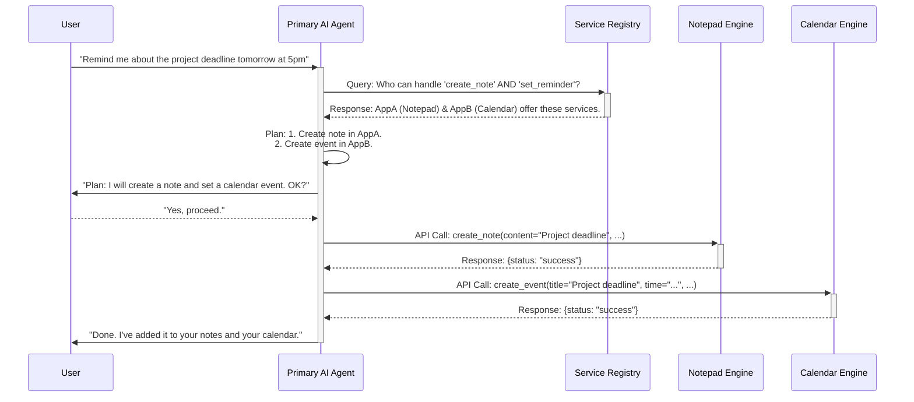
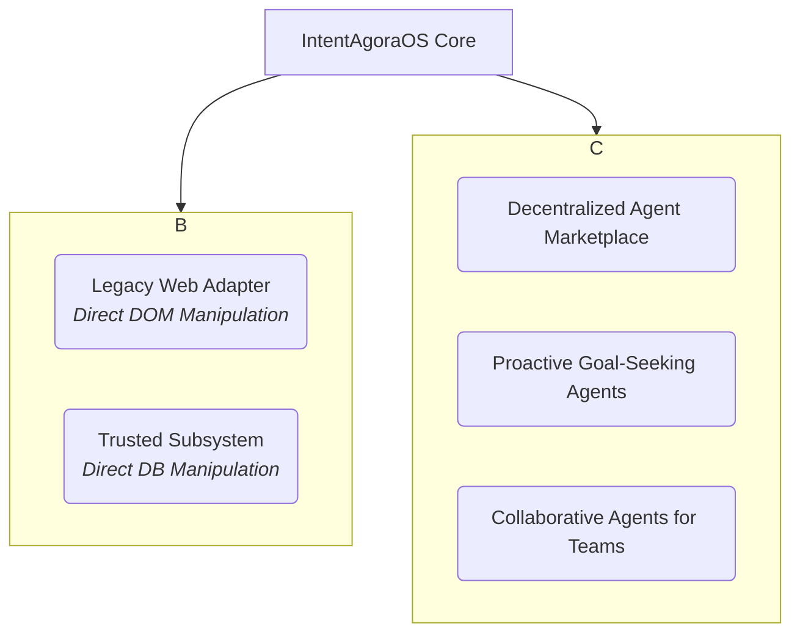

# IntentAgoraOS

**A Blueprint for an Agent-Oriented Operating System**

> "Instead of you working for your computer, your computer should work for you."

---

### 1. The Problem: Why Do We Need a New OS?

Computers today are incredibly powerful, but they are also incredibly demanding. To accomplish any complex task—like planning a trip, creating a report, or launching a marketing campaign—we are forced to act as human glue.

We open dozens of tabs and applications. We manually copy-paste data from a spreadsheet to a presentation. We learn complex menus and keyboard shortcuts for each piece of software. We spend more time *managing our tools* than we do on the actual creative or strategic work.

Our current operating systems force us to think like a computer. **IntentAgoraOS is designed to make the computer think like us.**

### 2. The Solution in One Sentence

IntentAgoraOS is a new kind of operating system where you simply state your goal (your "intent") in plain language, and an intelligent AI "Conductor" orchestrates all the necessary applications and services to make it happen for you.

---

### 3. The Core Vision: From Tool to Partner

Our vision is to evolve the computer from a passive tool that requires direct, skillful manipulation into an active, intelligent partner.

Imagine telling your computer:
*   *"Plan a 3-day weekend trip to the coast for two people next month, keep the budget under $500, and show me options that are pet-friendly."*
*   *"Take last quarter's sales data, generate a summary report with charts showing regional growth, and send it to the management team."*

In IntentAgoraOS, this becomes possible. You focus on the "what" and the "why," and the OS handles the "how," freeing you to solve bigger problems.

---

### 4. How It Works: The Four Pillars

In this new paradigm, the user expresses their **goal or intent** to a primary AI Agent. This Agent, in turn, discovers, coordinates, and orchestrates a symphony of "headless" applications and services to achieve that goal. The computer transforms from a passive tool into an active, intelligent partner, freeing human potential to focus on creativity, strategy, and high-level thinking.

### 5. How It Works: A Visual Representation

To make the data flow clearer, here is a Mermaid diagram illustrating a typical user request:

### 6. The Four Pillars: System Architecture

IntentAgoraOS is built upon four foundational pillars that work in concert:

#### a. The Hybrid AI Agent (The "Conductor")
The user's primary interface to the digital world. It's a hybrid entity designed for both power and privacy.
*   **On-Device Component:** A small, efficient language model that runs locally. It acts as the privacy gatekeeper, handles immediate tasks, understands personal context, and decides what information, if any, needs to be sent to the cloud.
*   **Cloud-Connected Component:** For tasks requiring immense computational power or access to vast, real-time information, the local agent can securely consult larger, more powerful cloud-based models under strict, user-defined privacy constraints.

#### b. The Universal Communication Protocol (The "Nervous System")
This is the `lingua franca` that allows all components to communicate. We will adopt and build upon emerging open standards to prevent a fragmented ecosystem.
*   **Model-Context Protocol (MCP):** Defines *how* an Agent can understand and use the tools/capabilities offered by an application. It's the "user manual" for a headless service.
*   **Agent-to-Agent Protocol (A2A):** Defines *how* different Agents can discover, negotiate, and collaborate with each other to fulfill complex, multi-stage tasks.

#### c. Headless Applications (The "Orchestra")
Applications in IntentAgoraOS are architected as **Capability Engines**. They shed the complexity of a graphical user interface and instead expose their core functionalities securely via an API that adheres to the Universal Communication Protocol. They are built to be controlled by Agents, not directly by humans.

#### d. The Intent Interface (The "Podium")
The traditional desktop is replaced by a fluid, conversational interface. The primary mode of input is natural language (voice or text). While the system can dynamically generate temporary UI components for specific tasks (e.g., a color picker, a confirmation button), the core interaction is dialogue-based.

### 7. Guiding Principles & Core Mechanisms

These are the rules and mechanisms that govern the behavior of the OS.

#### a. API-First as a Golden Rule
Every interaction between an Agent and an Application is a formal API call. There is no direct manipulation of an application's code or database. This ensures security, stability, and maintainability.

#### b. Discovery through Agent Cards
**Problem:** How does an Agent know what applications exist and what they can do?
**Solution:** Every application, upon installation, publishes its **Agent Card** to a system-wide **Service Registry (the "Agora")**. This card is a standardized, machine-readable profile containing:
*   A unique ID.
*   A list of all its capabilities (Service Offerings), formatted according to MCP.
*   The API endpoint for communication.
*   Security credentials.

#### c. The Intent-to-API Translation & The Confirmation Step
**Problem:** How do we prevent misunderstandings and catastrophic errors?
**Solution:** For any non-trivial or irreversible task, the Agent must follow a two-step process:
1.  **Planning:** The Agent translates the user's intent into a sequence of proposed API calls.
2.  **Confirmation:** The Agent presents this plan to the user in simple, human-readable language.
    *   *Agent: "I will get the latest sales data, create a bar chart, and email it to your manager. Is this correct?"*
    *   The Agent only proceeds after receiving explicit user confirmation.

#### d. Personalization via Agent Memory
**Problem:** How does the system adapt to the user's unique workflow?
**Solution:** The primary Agent maintains a secure, local, long-term memory. It uses this to store user preferences, learned behaviors, and important context *with the user's explicit permission*.
*   *Example: If the user always corrects the Agent to use `App_B` instead of `App_A` for a certain task, the Agent will ask, "Should I remember this for next time?" and update its preference.*

#### e. The 3-Tier Error Handling Hierarchy
**Problem:** How does the system handle failure gracefully?
**Solution:** The Agent follows a hierarchy for error resolution:
1.  **Tier 1: Self-Recovery:** Attempt to resolve the issue autonomously (e.g., retry a failed network request).
2.  **Tier 2: Autonomous Decision:** If self-recovery fails, make a safe, logical decision for low-risk issues (e.g., "PDF export failed, I will try DOCX instead.").
3.  **Tier 3: User Consultation:** For high-risk or ambiguous failures, halt the process and ask the user for guidance, providing clear options.

#### f. Dynamic Interaction Toolkit
**Problem:** How do we handle tasks that are inherently visual or require precise input?
**Solution:** The Agent has a built-in toolkit to generate temporary, on-demand UI components. Instead of being limited to language, it can ask questions using:
*   Yes/No prompts
*   Multiple-choice buttons
*   Sliders for numerical input
*   Color pickers
*   Text input fields
*   Image selection/cropping tools

This combines the power of language with the precision of a GUI, offering the best of both worlds.

### 8. Example Workflow: Creating a Simple Note

1.  **User Intent:** "Hey, remind me to buy milk tomorrow morning."
2.  **Agent Analysis:** The primary Agent identifies the core intent: `create_reminder_note`. It extracts the entities: `content="buy milk"`, `time="tomorrow morning"`.
3.  **Service Discovery:** The Agent queries the Service Registry: "Who can handle `create_note` or `set_reminder`?". The Registry returns the Agent Card for the `com.example.notepad-engine`.
4.  **Capability Inspection:** The Agent reads the card and understands that `notepad-engine` has a function `create_note(content: string, reminder_time: datetime)`.
5.  **Execution:** The Agent calls the `notepad-engine`'s API endpoint with the parsed data.
6.  **Confirmation:** The `notepad-engine` returns a success message. The Agent informs the user: "Done. I will remind you to buy milk tomorrow morning."
7.  **Interface Update:** The "view-only" interface of the notepad application refreshes automatically to show the new note.

### 9. Future Ideas & "Scribbles on the Napkin"

This section is dedicated to exploring the untapped potential and long-term possibilities of IntentAgoraOS. It also acknowledges the need for practical, albeit less elegant, solutions for interacting with the world as it exists today.

#### **Part A: Strategies for the "Imperfect" World**

The core design of IntentAgoraOS relies on applications adhering to a clean, modern protocol. But the real world is messy. Here's how we might bridge the gap.

##### a. The "Legacy Web" Adapter: Direct DOM Manipulation
*   **Concept:** For the millions of websites and legacy web apps that will never adopt the A2A/MCP protocols, we can develop a specialized "Adapter Agent." This agent would use a combination of Vision AI (to visually parse a webpage like a human) and direct DOM (Document Object Model) manipulation to interact with these sites. It would programmatically find and click buttons, fill out forms, and scrape data.
*   **Use Case:** Allowing a user to order a pizza or book a flight from a local airline's website that doesn't have a modern API.
*   **Challenge:** This approach is inherently brittle. A small change in the website's layout can break the agent's logic. It should be considered a "last resort" compatibility layer, used when no formal API is available.

##### b. The "Trusted Subsystem" Adapter: Direct Database Manipulation
*   **Concept:** In some high-performance or deeply integrated enterprise environments, it may be necessary to grant a highly trusted, specialized agent direct access to an application's database. This "Trusted Subsystem" adapter would bypass the API layer entirely and execute operations (e.g., SQL queries) directly on the data source.
*   **Use Case:** Performing a massive data analysis and bulk update on a multi-terabyte internal database where the overhead of millions of API calls would be prohibitive.
*   **Challenge:** This is the highest-risk interaction model. It bypasses all business logic, validation, and security layers of the application. Its use must be strictly limited to sandboxed, highly controlled environments and governed by extremely granular permissions.

#### **Part B: Visions for the "Perfect" World**

Once the ecosystem matures, what new frontiers can we explore?

##### c. The Distributed Agent Marketplace
*   **Concept:** An evolution of the "Agora" from a simple local registry into a decentralized, global marketplace. A developer in Japan could build a highly specialized "Haiku-writing Agent," publish it to the marketplace, and users worldwide could have their Primary Agent *hire* it for specific tasks, possibly paying a micro-transaction fee. This creates a true "economy of skills" for AI.
*   **Challenge:** This opens up massive security, trust, and economic modeling questions. How do you vet these agents? How do you prevent malicious actors?

##### d. Proactive, Goal-Seeking Agents
*   **Concept:** The user could assign a high-level, long-term goal to an Agent, like *"Help me learn Spanish"* or *"Help me get in shape."* The Agent would then proactively work in the background, making small suggestions (e.g., "Duolingo reminder: time for your 5-minute lesson?"), scheduling activities, finding resources, and tracking progress. It would move from being a reactive "executor" to a proactive "coach".
*   **Challenge:** This requires an extremely sophisticated understanding of human psychology, ethics, and maintaining a delicate balance between being helpful and being intrusive.

#### A Visual Representation of These Ideas

---

### 10. License

An MIT open-source license to encourage adoption and collaboration.
